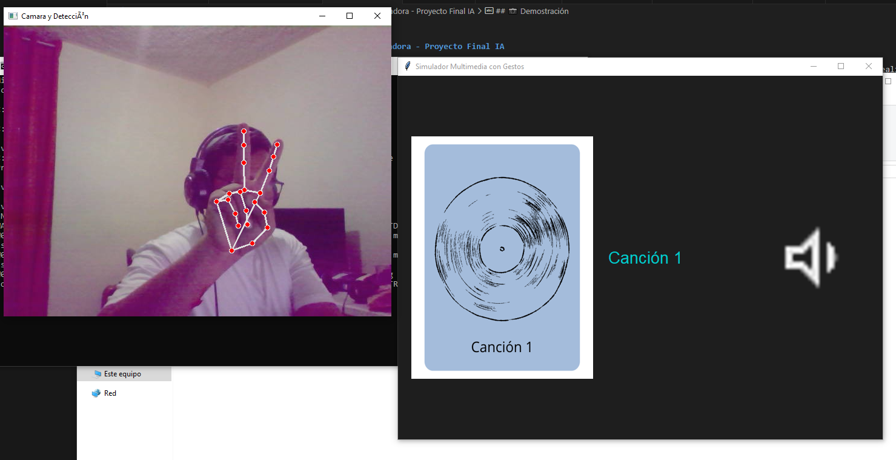

David André Rodríguez Cano - 1164619

# 🖐️ Reconocimiento de Gestos con Visión por Computadora - Proyecto Final IA

Este proyecto utiliza **visión por computadora**, **MediaPipe** y **Machine Learning** para detectar gestos de la mano en tiempo real mediante la cámara, y realizar acciones multimedia como reproducir música, subir/bajar volumen o cambiar de canción. Además, cuenta con una interfaz gráfica amigable con imágenes y portadas de canciones.

---

## 📷 Demostración


---

## 🎯 Funcionalidades principales

| Gesto         | Acción del sistema       | Visual en interfaz        |
|---------------|--------------------------|----------------------------|
| ✋ palma       | ⏯️ Play / Pause           | Ícono cambia a Play/Pause |
| ✊ puño        | ⏭️ Siguiente canción       | Cambia imagen y nombre    |
| 🤙 señal       | 🔊 Subir volumen          | Ícono de volumen ↑        |
| ✌️ dedos       | 🔉 Bajar volumen          | Ícono de volumen ↓        |

---

## 📦 Estructura del Proyecto

Proyecto_2/
├── modelos/
│ └── modelo_gestos.pkl # Modelo SVM entrenado
├── app/
│ ├── interfaz_gestos.py # Interfaz final con control multimedia
│ ├── app_tkinter.py # Primera version del proyecto solo camara
│ ├── canciones/
│ │ ├── cancion1.png
│ │ └── cancion2.png
│ └── icons/
│ ├── play.png
│ ├── pause.png
│ ├── next.png
│ ├── volume_up.png
│ ├── volume_down.png

---

## 🛠️ Instalación

1. Clona el repositorio o copia los archivos en una carpeta.
2. Crea y activa un entorno virtual (opcional pero recomendado):

```bash
python -m venv venv
venv\Scripts\activate  # en Windows

▶️ Ejecución
Asegúrate de tener las imágenes y el modelo entrenado (modelo_gestos.pkl) en las rutas correctas.

Ejecuta la aplicación desde la carpeta app/:

cd app
python interfaz_gestos.py

💻 Tecnologías utilizadas
Python 3

- MediaPipe
- OpenCV
- Scikit-learn
- Pillow (PIL)
- Tkinter

🤖 Modelo entrenado
Se entrenó un modelo SVM (Support Vector Machine) con los landmarks de MediaPipe Hands para 4 gestos:

- palma
- punio
- senal
- dedos

🎓 Autor
Proyecto desarrollado por David Rodríguez